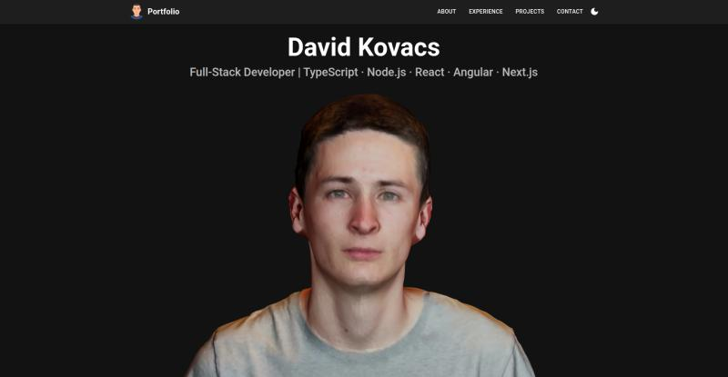

# Portfolio Website

A modern and interactive portfolio website built to showcase my skills, experience, and projects.  
Designed with responsiveness, accessibility, and performance in mind.

## 🚀 Live Demo
[View Portfolio](https://davidkovacs.vercel.app)

## 🛠️ Tech Stack
- React with TypeScript
- Material-UI (MUI)
- Three.js / 3D interactive elements
- Responsive design with modern animations

## ✨ Features
- Interactive 3D portrait
- Animated tech stack carousel
- Dark/light theme toggle
- Smooth scrolling navigation
- Optimized for desktop and mobile

## 📂 Getting Started
Clone the repo and install dependencies:
```bash
git clone https://github.com/davidkakov111/portfolio.git
cd portfolio
pnpm install
pnpm dev
```
For instructions on creating a compatible 3D character, see [3D Setup Guide](./3D-SETUP.md).

## 📸 Preview



## 📬 Contact

Interested in working together?
    - [Email](mailto:kovacs.cs.david@gmail.com)
    - [LinkedIn](https://www.linkedin.com/in/davidkov111/)
    - [Upwork](https://www.upwork.com/freelancers/~01b1e7ca6298d8da33)
